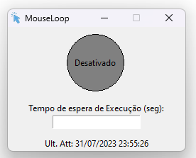
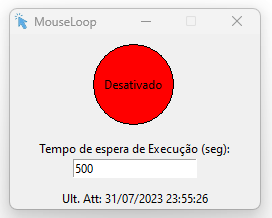
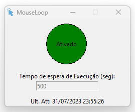
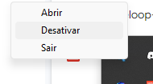

# MouseLoop

**MouseLoop** é um simples aplicativo em Python para simular o movimento do mouse em intervalos regulares e evitar que o computador entre no modo de suspensão ou tela de bloqueio.

## Como usar

1. Certifique-se de que você tenha o Python 3 instalado em seu computador.
2. Instale as bibliotecas necessárias executando o seguinte comando:

```bash
pip install pyautogui pystray pillow
```

3. Clone este repositório em seu computador:
```bash
git clone https://github.com/ragjvictor/MouseLoop.git
```

4. Navegue para o diretório MouseLoop:
```bash
cd MouseLoop
```

5. Execute o aplicativo:
```bash
python MouseLoop.py
```

6. Será aberto o programa diretamente na bandeja do windows. Clique com o botão direito para Abrir:
   
<p align="center">
  
</p>

7. O programa tem a Opção de Ativar e Desativar, o tempo de espera de execução em Segundos e a informação da ultima execução. Não é possivel executar sem antes informar o tempo de espera de execução.

<p align="center">
  
</p>

<p align="center">
  
</p>

<p align="center">
  
</p>

8. Após a ativado, ele irá executar uma verificação da ultima posição do seu mouse com a atual, no tempo delimitado de espera. Caso não tiver tido alteração nessa posição ele move o mouse de forma randômica.
9. Ao fechar o programa pelo botão de fechar, ele apenas irá para bandeja do Windows, sendo necessário fechar pelo icone. Também é possível alterar o status pelo icone. (Só aparecerá a opção caso tenha algum tempo informado no programa)
<p align="center">
  
</p>

## Funcionalidades

- O aplicativo permite que você defina um intervalo de tempo para movimentar o mouse automaticamente em intervalos regulares.
- O menu da bandeja do sistema (systray) permite ativar/desativar a movimentação automática do mouse.
- Ao clicar com o botão esquerdo do mouse no ícone da bandeja do sistema, você pode ativar ou desativar o MouseLoop.
- O ícone da bandeja do sistema é atualizado dinamicamente para refletir o estado atual do MouseLoop (Ativado/Desativado).
- O campo "Tempo de espera de Execução" permite que você defina o intervalo de tempo (em segundos) entre as movimentações do mouse.

## Aplicação e Objetivo

- O objetivo principal foi utilizar ferramentas de processamento paralelo além de estudar o funcionamento de programas pela bandeja do Windows
- A escolha dessa função foi para impedir que eu fique ausente no Discord :laughing:
- Outro objetivo é utilizar esse mecanismo para fazer uma especie de Boot, onde posso cadastrar executaveis, .bat ou até mesmo scripts python para executar de forma automatica nos determinados horarios que eu definir. Estarei trabalhando nisso...

## Download
- RAR do app: [mouseloop.RAR](https://drive.google.com/file/d/1T2ZTQqkeCNnq0cmc9hrY1VpiERqiXv6X/view?usp=sharing)
